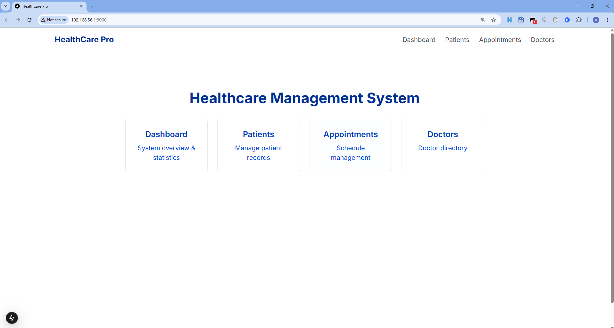
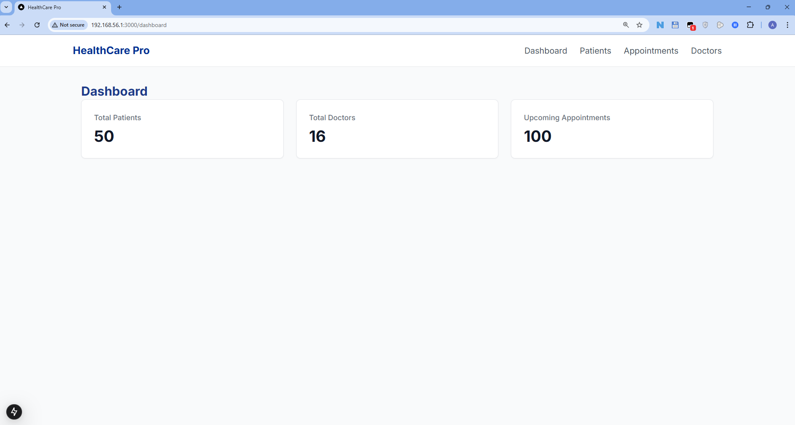
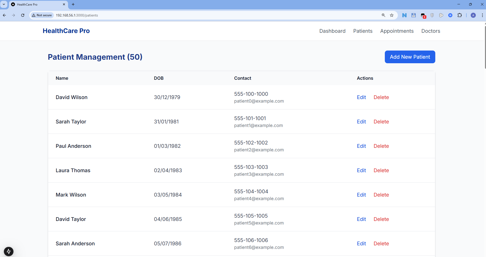
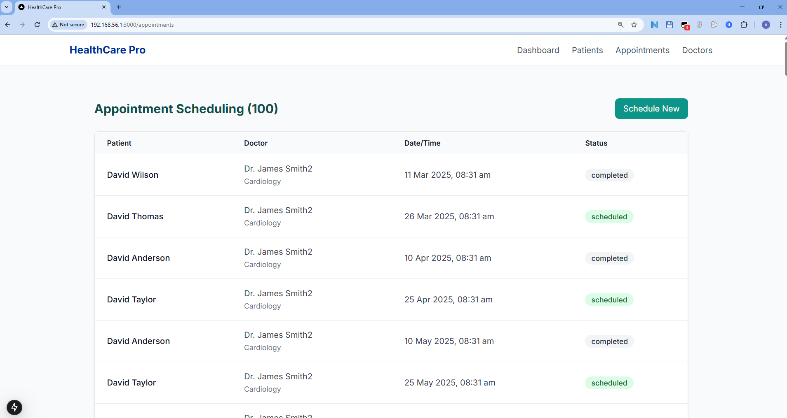
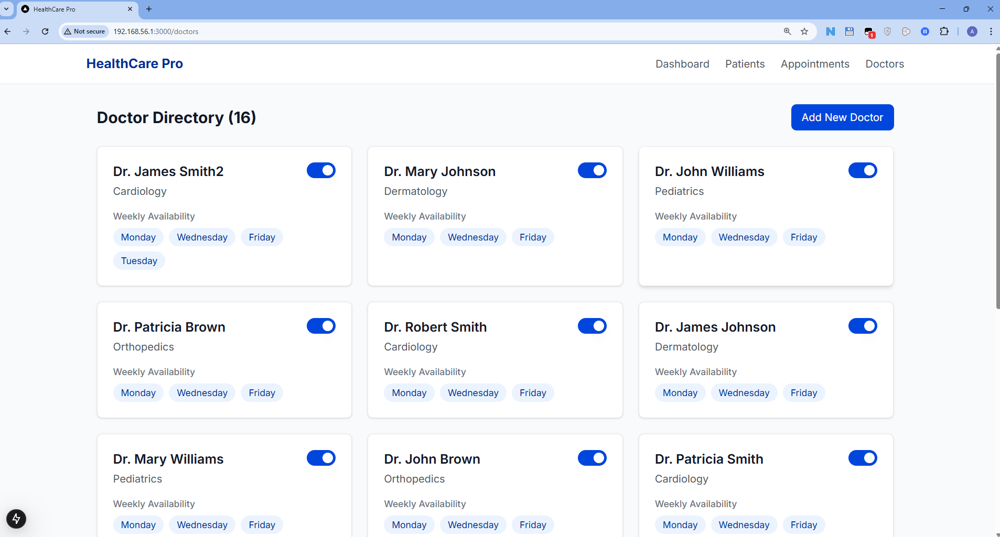
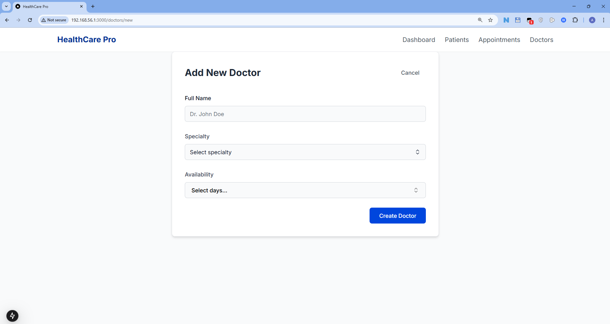
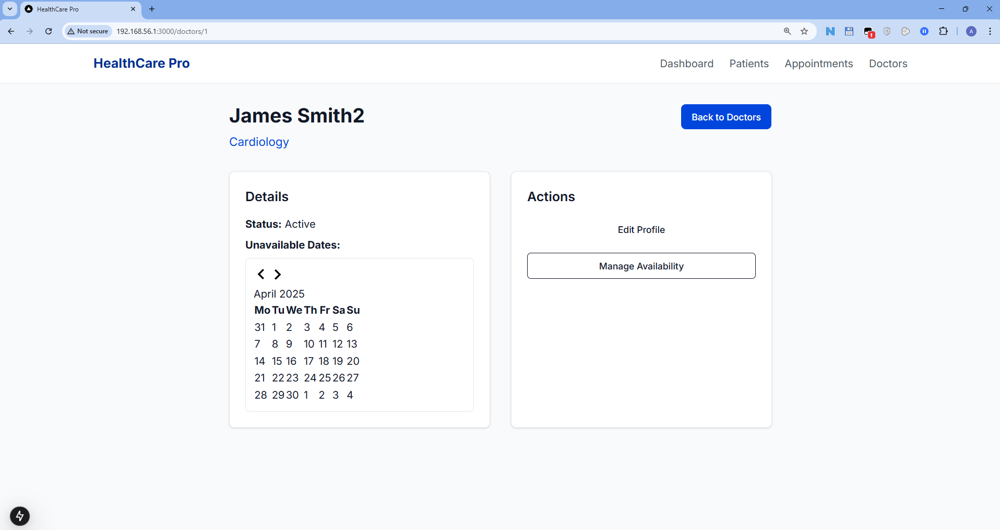
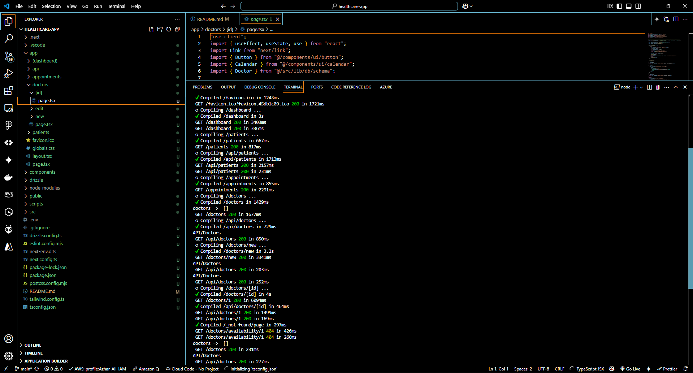

___
# healthcare-app (by **Azhar Ali**)

___
## All my projects are NDA Protected, so I made this demo with enough change to overcome NDA restrictions but also show my skills in this project. This is actual system, used in some hospitals.

### **Tech stack Used,**
+ Typescript, 
+ Next.js, 
+ drizzle ORM, 
+ tailwind.css.
+ Database MySQL

___

## Front Page of Health Care App

## Dashboard of Health Care App

## Patient Managment Page of Health Care App

## Appointment Scheduling Page of Health Care App

## Doctor Directory/Managment Page of Health Care App

## Add New Doctor Page of Health Care App

## Edit Doctor Page of Health Care App

## VSCode Screenshot of actual App Running with Next.js Log Messages

 
 
 
 
 
 

## To launch = npm run dev
